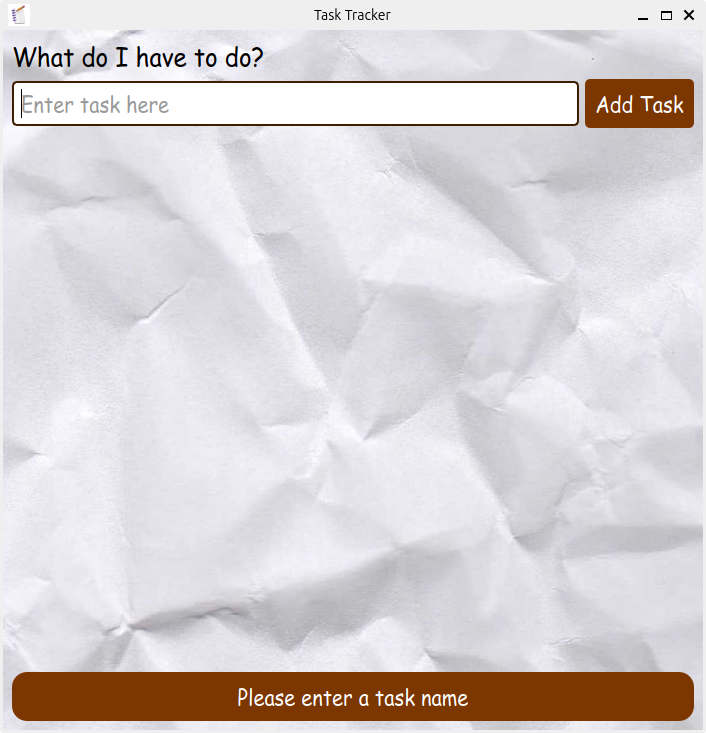

# 📝 Task Tracker

A minimal, custom GUI task tracking app built with **PyQt5**.  
Track your tasks with style — includes toast notifications, autosave to JSON, and a retro-stationery aesthetic.

 <!-- optional, add if you want -->

---

## ✨ Features

- Add, check off, and delete tasks
- Task persistence via `tasks.json`
- Beautiful custom UI with icons and background
- Toast notifications for user feedback
- Cross-platform: Windows, Linux, macOS (via PyInstaller)

---

## 🛠 Tech Stack

- Python 3.9+
- PyQt5
- JSON for storage
- PyInstaller (for building executables)

---

## 🚀 Getting Started (Development)

### 1. Clone the repo

bash
git clone https://github.com/your-username/task-tracker.git
cd task-tracker

---

## 🐧 Install on Linux (Ubuntu/Debian)

You can install Task Tracker with the .deb package:

wget https://github.com/niicommey01/Task-Tracker-App/releases/download/v1.0/task-tracker_1.0_amd64.deb
sudo dpkg -i task-tracker_1.0_amd64.deb

